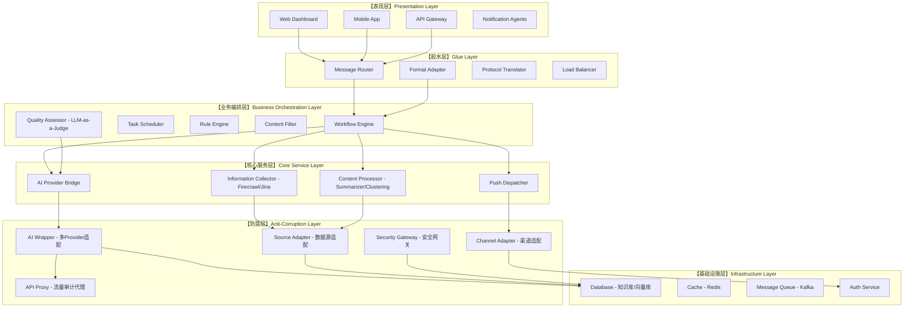
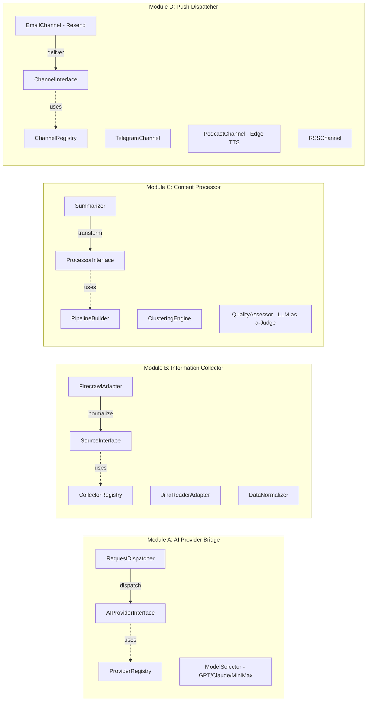
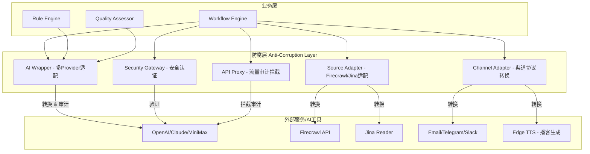
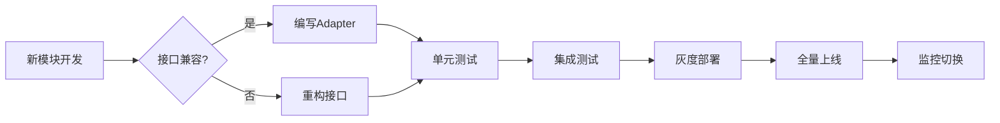
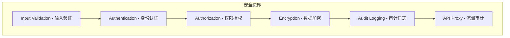
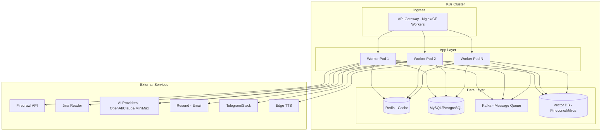
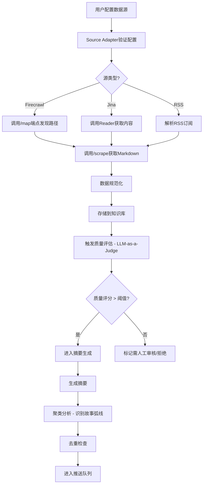
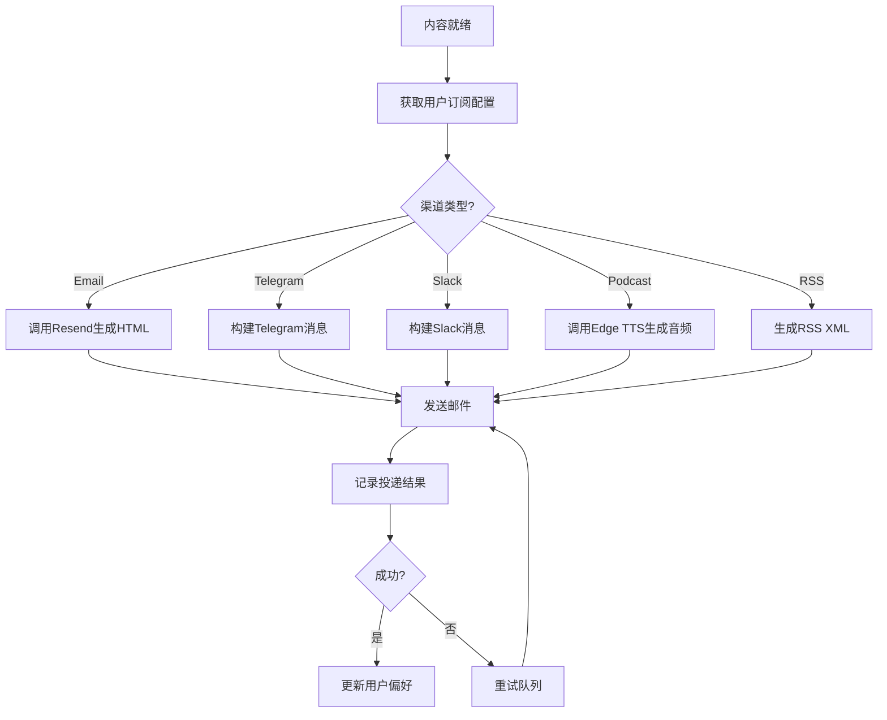

# AI高度客制化资讯推送系统可行性架构设计（优化版）

## 一、架构设计总览

### 1.1 设计目标

基于《基于多样化AI工具链构建高度客制化资讯推送系统的架构设计与实现研究报告》与《开发环境与安全规划的思考过程》两份文档的分析，本架构旨在构建一个**高度客制化、可扩展、安全可靠**的AI资讯推送系统。

**核心设计原则**：
- **高模块化**：每个功能单元独立封装，职责单一
- **高拓展性**：通过插件机制和接口抽象支持功能扩展
- **胶水层架构**：通过适配器粘合不同模块，处理协议转换
- **弱耦合、可拔插**：模块间通过接口通信，支持热插拔
- **SOLID原则**：严格遵循面向对象设计原则
- **防腐层设计**：预置Wrapper与Dispatcher机制，确保模块可平滑替换

### 1.2 系统架构层次图



---

## 二、核心模块设计

### 2.1 模块架构总览

基于调研文档中的AI工具链，本系统采用以下核心模块架构：



### 2.2 模块详细设计

#### 2.2.1 AI Provider Bridge（AI提供者桥接器）

**职责**：统一管理多种AI服务的接入，支持灵活切换（如OpenAI、Claude、MiniMax等）

**接口定义**：

```typescript
// AI Provider Interface - 单一职责原则
interface IAIProvider {
    // 发送请求到AI服务
    sendRequest(prompt: Prompt): Promise<AIResponse>;
    
    // 获取提供商元信息
    getMetadata(): ProviderMetadata;
    
    // 健康检查
    healthCheck(): Promise<boolean>;
}

// Prompt抽象 - 开闭原则
interface Prompt {
    content: string;
    parameters: Record<string, any>;
    options?: RequestOptions;
}

// AI响应抽象
interface AIResponse {
    content: string;
    metadata: ResponseMetadata;
    usage: UsageInfo;
}
```

**模块结构**：

```
ai-provider-bridge/
├── interfaces/
│   ├── IAIProvider.ts
│   ├── IPrompt.ts
│   └── IResponse.ts
├── providers/
│   ├── base/
│   │   └── BaseProvider.ts
│   ├── openai/
│   │   └── OpenAIProvider.ts
│   ├── anthropic/
│   │   └── AnthropicProvider.ts
│   ├── minimax/
│   │   └── MiniMaxProvider.ts
│   ├── google/
│   │   └── GoogleAIProvider.ts
│   └── custom/
│       └── CustomProvider.ts
├── registry/
│   └── ProviderRegistry.ts
├── dispatcher/
│   └── RequestDispatcher.ts
├── selector/
│   └── ModelSelector.ts  # 模型选择器
└── factory/
    └── ProviderFactory.ts
```

**防腐层设计 - AI Wrapper**：

```typescript
// AI Provider Wrapper - 防腐层核心
class AIProviderWrapper implements IAIProvider {
    private provider: IAIProvider;
    private retryStrategy: IRetryStrategy;
    private circuitBreaker: ICircuitBreaker;
    private logger: ILogger;

    constructor(
        provider: IAIProvider,
        config: WrapperConfig
    ) {
        this.provider = provider;
        this.retryStrategy = new ExponentialBackoffRetry();
        this.circuitBreaker = new CircuitBreaker(config.circuitBreakerThreshold);
    }

    async sendRequest(prompt: Prompt): Promise<AIResponse> {
        // 1. 熔断器检查
        if (this.circuitBreaker.isOpen()) {
            throw new CircuitBreakerOpenException();
        }

        // 2. 重试策略
        try {
            return await this.retryStrategy.execute(
                () => this.provider.sendRequest(prompt)
            );
        } catch (error) {
            this.circuitBreaker.recordFailure();
            throw error;
        }
    }
}

// 多Provider统一调度器
class UnifiedAIWrapper {
    private wrappers: Map<string, AIProviderWrapper> = new Map();
    private fallbackStrategy: FallbackStrategy;
    private modelSelector: ModelSelector;

    registerProvider(name: string, wrapper: AIProviderWrapper): void {
        this.wrappers.set(name, wrapper);
    }

    async dispatch(request: AIRequest): Promise<AIResponse> {
        // 1. 模型选择（根据任务类型选择最优Provider）
        const providerName = this.modelSelector.select(request.taskType);
        
        try {
            return await this.wrappers.get(providerName).sendRequest(request.prompt);
        } catch (error) {
            // 2. 故障转移策略
            return await this.fallbackStrategy.handle(error, request);
        }
    }
}
```

#### 2.2.2 Information Collector（信息采集器）

**职责**：从多种来源采集资讯，支持Firecrawl、Jina Reader等工具

**接口定义**：

```typescript
// 信息源接口 - 里氏替换原则
interface IInformationSource {
    // 采集数据
    collect(config: SourceConfig): Promise<RawData[]>;
    
    // 验证源可用性
    validate(): Promise<boolean>;
    
    // 获取源类型
    getType(): SourceType;
}

// Firecrawl专用接口
interface IFirecrawlSource extends IInformationSource {
    map(url: string): Promise<string[]>;
    scrape(url: string): Promise<MarkdownContent>;
    crawl(url: string, options: CrawlOptions): Promise<void>;
    search(query: string): Promise<SearchResult[]>;
}

// Jina Reader专用接口
interface IJinaReaderSource extends IInformationSource {
    read(url: string): Promise<StructuredContent>;
    extractImages(url: string): Promise<ImageDescription[]>;
}
```

**模块结构**：

```
information-collector/
├── interfaces/
│   ├── IInformationSource.ts
│   ├── ISourceConfig.ts
│   └── IDataNormalizer.ts
├── sources/
│   ├── base/
│   │   └── BaseSource.ts
│   ├── firecrawl/
│   │   ├── FirecrawlAdapter.ts
│   │   ├── MapEndpoint.ts
│   │   ├── ScrapeEndpoint.ts
│   │   ├── CrawlEndpoint.ts
│   │   ├── SearchEndpoint.ts
│   │   └── AgentEndpoint.ts
│   ├── jina/
│   │   ├── JinaReaderAdapter.ts
│   │   └── ImageDescriber.ts
│   ├── rss/
│   │   └── RSSSource.ts
│   ├── api/
│   │   └── APISource.ts
│   ├── database/
│   │   └── DatabaseSource.ts
│   └── social/
│       └── SocialMediaSource.ts
├── normalizer/
│   └── DataNormalizer.ts
├── registry/
│   └── SourceRegistry.ts
└── adapter/
    └── SourceAdapter.ts  # 防腐层
```

#### 2.2.3 Content Processor（内容处理器）

**职责**：对采集的原始内容进行AI处理、分类、摘要、质量评估

**接口定义**：

```typescript
// 处理器接口 - 接口隔离原则
interface IContentProcessor {
    process(content: RawContent): Promise<ProcessedContent>;
    getProcessorType(): ProcessorType;
}

// 专业化处理器 - 职责单一
interface ISummarizer extends IContentProcessor {
    summarize(content: RawContent, options: SummaryOptions): Promise<Summary>;
}

interface IClassifier extends IContentProcessor {
    classify(content: RawContent): Promise<Category[]>;
}

interface ITranslator extends IContentProcessor {
    translate(content: RawContent, targetLang: string): Promise<TranslatedContent>;
}

// 质量评估器 - LLM-as-a-Judge
interface IQualityAssessor {
    assess(content: RawContent, criteria: AssessmentCriteria): Promise<QualityScore>;
    batchAssess(contents: RawContent[]): Promise<QualityScore[]>;
    buildSiteProfile(scores: QualityScore[]): Promise<SiteProfile>;
}
```

**评估维度（基于调研文档）**：

```typescript
// 质量评估标准
interface AssessmentCriteria {
    // 1. 技术深度 (1-5分)
    technicalDepth: number;
    
    // 2. 新颖性 - 72小时内首发 (1-5分)
    novelty: number;
    
    // 3. 可信度 - 引用数据源/GitHub/论文 (1-5分)
    credibility: number;
    
    // 4. 实操性 - 可完成特定工程任务 (1-5分)
    practicality: number;
}

interface QualityScore {
    overall: number;
    breakdown: AssessmentCriteria;
    recommendation: 'approve' | 'reject' | 'manual_review';
}
```

**处理管道设计**：

```typescript
// 处理管道构建器 - 依赖倒置原则
class ProcessingPipelineBuilder {
    private processors: IContentProcessor[] = [];

    addProcessor(processor: IContentProcessor): this {
        this.processors.push(processor);
        return this;
    }

    build(): ProcessingPipeline {
        return new ProcessingPipeline(this.processors);
    }
}

class ProcessingPipeline {
    constructor(private processors: IContentProcessor[]) {}

    async execute(input: RawContent): Promise<ProcessedContent> {
        let result = input;
        for (const processor of this.processors) {
            result = await processor.process(result);
        }
        return result;
    }
}
```

#### 2.2.4 Push Dispatcher（推送调度器）

**职责**：将处理后的内容分发到多种渠道

**接口定义**：

```typescript
// 推送渠道接口 - 开闭原则
interface IPushChannel {
    send(content: ProcessedContent, target: PushTarget): Promise<DeliveryResult>;
    getChannelType(): ChannelType;
    validateTarget(target: PushTarget): boolean;
}

// 推送目标
interface PushTarget {
    userId: string;
    channel: ChannelType;
    address: string;
    preferences?: UserPreferences;
}

// 渠道类型
enum ChannelType {
    EMAIL = 'email',
    TELEGRAM = 'telegram',
    SLACK = 'slack',
    PODCAST = 'podcast',
    RSS = 'rss',
    WEBHOOK = 'webhook'
}
```

**模块结构**：

```
push-dispatcher/
├── interfaces/
│   ├── IPushChannel.ts
│   ├── IPushTarget.ts
│   └── IDeliveryTracker.ts
├── channels/
│   ├── base/
│   │   └── BaseChannel.ts
│   ├── email/
│   │   └── EmailChannel.ts  # Resend集成
│   ├── telegram/
│   │   └── TelegramChannel.ts
│   ├── slack/
│   │   └── SlackChannel.ts
│   ├── podcast/
│   │   └── PodcastChannel.ts  # Edge TTS集成
│   ├── rss/
│   │   └── RSSChannel.ts
│   └── webhook/
│       └── WebhookChannel.ts
├── tracker/
│   └── DeliveryTracker.ts
└── adapter/
    └── ChannelAdapter.ts  # 防腐层
```

---

## 三、防腐层设计

### 3.1 防腐层架构图



### 3.2 Wrapper与Dispatcher设计

#### 3.2.1 AI Provider Wrapper

```typescript
// 统一的AI Provider包装器 - 支持多模型切换
class UnifiedAIWrapper {
    private wrappers: Map<string, AIProviderWrapper> = new Map();
    private fallbackStrategy: FallbackStrategy;
    private modelSelector: ModelSelector;
    private auditLogger: IAuditLogger;

    registerProvider(name: string, wrapper: AIProviderWrapper): void {
        this.wrappers.set(name, wrapper);
    }

    async dispatch(request: AIRequest): Promise<AIResponse> {
        // 1. 模型选择
        const providerName = this.modelSelector.select(request.taskType);
        
        // 2. 记录审计日志
        this.auditLogger.log('AI_REQUEST', {
            provider: providerName,
            taskType: request.taskType,
            timestamp: Date.now()
        });

        try {
            return await this.wrappers.get(providerName).sendRequest(request.prompt);
        } catch (error) {
            // 3. 故障转移策略
            this.auditLogger.log('AI_FALLBACK', { error: error.message });
            return await this.fallbackStrategy.handle(error, request);
        }
    }
}
```

#### 3.2.2 Source Adapter（源适配器）

```typescript
// 数据源适配器 - 隔离外部变化
class SourceAdapter implements IInformationSource {
    private adapters: Map<SourceType, IAdapter> = new Map();
    private translator: DataTranslator;
    private validator: InputValidator;
    private rateLimiter: IRateLimiter;

    constructor() {
        // 注册适配器
        this.adapters.set(SourceType.FIRECRAWL, new FirecrawlAdapter());
        this.adapters.set(SourceType.JINA, new JinaReaderAdapter());
        this.adapters.set(SourceType.RSS, new RSSAdapter());
    }

    async collect(config: SourceConfig): Promise<RawData[]> {
        // 1. 配置验证
        this.validator.validate(config);

        // 2. 速率限制
        await this.rateLimiter.check(config.sourceType);

        // 3. 获取适配器
        const adapter = this.adapters.get(config.sourceType);
        if (!adapter) {
            throw new UnsupportedSourceException(config.sourceType);
        }

        // 4. 调用外部系统
        const rawData = await adapter.fetch(config);

        // 5. 转换为内部格式
        return rawData.map(item => this.translator.toInternal(item));
    }
}
```

#### 3.2.3 Channel Adapter（渠道适配器）

```typescript
// 推送渠道适配器 - 隔离外部API变化
class ChannelAdapter implements IPushChannel {
    private externalAdapter: ExternalChannelAdapter;
    private formatConverter: MessageFormatter;
    private rateLimiter: RateLimiter;
    private deduplicator: ContentDeduplicator;

    async send(content: ProcessedContent, target: PushTarget): Promise<DeliveryResult> {
        // 1. 去重检查
        const fingerprint = this.deduplicator.compute(content);
        if (await this.deduplicator.exists(fingerprint)) {
            return { status: 'duplicate', fingerprint };
        }

        // 2. 速率限制检查
        await this.rateLimiter.check(target);

        // 3. 格式转换
        const formattedMessage = this.formatConverter.format(content, target.channel);

        // 4. 发送并跟踪
        const result = await this.externalAdapter.send(formattedMessage, target);

        // 5. 记录去重指纹
        await this.deduplicator.save(fingerprint);

        return this.tracker.track(result);
    }
}
```

#### 3.2.4 API Proxy（流量审计代理）

**重要性**：基于调研文档中的安全考量（如OpenClaw事件），必须实现本地流量审计

```typescript
// API Proxy - 流量审计代理
class APIPProxy {
    private filter: SensitiveDataFilter;
    private logger: AuditLogger;
    private blocker: RequestBlocker;

    async intercept(request: AIRequest): Promise<AIRequest> {
        // 1. 敏感数据扫描
        const sensitiveData = this.filter.scan(request.prompt.content);
        if (sensitiveData.length > 0) {
            this.logger.warn('SENSITIVE_DATA_DETECTED', {
                data: sensitiveData,
                timestamp: Date.now()
            });
            // 阻断或脱敏
            request.prompt.content = this.filter.redact(request.prompt.content);
        }

        // 2. 路径越界检查
        if (this.filter.hasPathTraversal(request.prompt.content)) {
            throw new SecurityException('Path traversal attempt detected');
        }

        // 3. 记录审计日志
        this.logger.log('API_REQUEST', {
            provider: request.provider,
            promptLength: request.prompt.content.length,
            timestamp: Date.now()
        });

        return request;
    }
}
```

---

## 四、模块替换策略

### 4.1 模块替换流程图



### 4.2 模块替换准备清单

| 替换类型 | 准备内容 | 防腐层组件 |
|---------|---------|-----------|
| AI Provider替换 | 新Provider实现、熔断配置 | AIProviderWrapper |
| 数据源替换 | 新源Adapter、字段映射 | SourceAdapter |
| 推送渠道替换 | 新渠道Adapter、格式转换 | ChannelAdapter |
| 存储层替换 | 新存储Adapter、查询转换 | StorageAdapter |
| TTS服务替换 | 新TTS Adapter、声音配置 | TTSAdapter |

### 4.3 版本兼容策略

```typescript
// 版本兼容性检查
class VersionCompatibilityChecker {
    checkCompatibility(
        oldModule: IModuleVersion,
        newModule: IModuleVersion
    ): CompatibilityResult {
        const breakingChanges = this.detectBreakingChanges(
            oldModule.interface,
            newModule.interface
        );

        return {
            isCompatible: breakingChanges.length === 0,
            breakingChanges,
            migrationPath: this.suggestMigration(breakingChanges)
        };
    }
}
```

---

## 五、安全架构设计

### 5.1 安全层次结构

基于调研文档中的安全规划，本系统实现多层安全防护：



### 5.2 安全网关设计

```typescript
// Security Gateway - 统一安全入口
class SecurityGateway {
    private validators: InputValidator[] = [];
    private authProvider: IAuthProvider;
    private encryptor: IEncryptor;
    private auditLogger: IAuditLogger;

    async validateRequest(request: Request): Promise<ValidationResult> {
        // 1. 输入验证
        for (const validator of this.validators) {
            const result = await validator.validate(request);
            if (!result.isValid) {
                this.auditLogger.log('VALIDATION_FAILED', request);
                return result;
            }
        }

        // 2. 身份认证
        const authResult = await this.authProvider.authenticate(request.token);
        if (!authResult.isAuthenticated) {
            this.auditLogger.log('AUTH_FAILED', request);
            throw new AuthenticationException();
        }

        // 3. 权限检查
        if (!this.checkAuthorization(authResult.user, request.resource)) {
            this.auditLogger.log('AUTHZ_FAILED', request);
            throw new AuthorizationException();
        }

        return { isValid: true };
    }
}
```

### 5.3 安全配置（基于调研文档建议）

```yaml
# 安全配置
security:
  # API代理配置
  api_proxy:
    enabled: true
    sensitive_data_filter:
      enabled: true
      patterns:
        - "\\.env"
        - "api_key"
        - "password"
        - "secret"
    path_traversal_check:
      enabled: true
    
  # 权限配置
  permissions:
    default_level: "read_only"
    require_approval_for:
      - "delete"
      - "system_command"
      - "external_network"
    
  # 审计配置
  audit:
    log_all_requests: true
    log_level: "detailed"
    retention_days: 90
```

---

## 六、SOID原则实现对照表

| 原则 | 实现方式 | 具体措施 |
|-----|---------|---------|
| **S 单一职责** | 每个类只负责一个功能 | Processor只做处理、Collector只做采集 |
| **O 开闭原则** | 对扩展开放，对修改关闭 | 通过继承和接口实现新功能 |
| **L 里氏替换** | 子类可替换父类 | 所有Provider继承BaseProvider |
| **I 接口隔离** | 多个专用接口 | ISummarizer、IClassifier、IQualityAssessor分离 |
| **D 依赖倒置** | 依赖抽象而非具体 | 依赖IAIProvider而非OpenAIProvider |

---

## 七、模块依赖关系矩阵

| 模块 | 依赖模块 | 依赖类型 | 可替换性 |
|-----|---------|---------|---------|
| AI Provider Bridge | ILogger, IRetryStrategy, IModelSelector | 接口 | 完全可替换 |
| Information Collector | IDataNormalizer, ICache, IFirecrawl, IJinaReader | 接口 | 完全可替换 |
| Content Processor | IAIProvider, IPipeline, IQualityAssessor | 接口 | 完全可替换 |
| Push Dispatcher | IDeliveryTracker, IRateLimiter, IDeduplicator | 接口 | 完全可替换 |
| Quality Assessor | IAIProvider, ICriteriaEvaluator | 接口 | 完全可替换 |
| Workflow Engine | 所有业务模块 | 接口 | 核心模块 |
| Security Gateway | IAuthProvider, IEncryptor, IAuditLogger | 接口 | 完全可替换 |
| API Proxy | IFilter, IBlocker, IAuditLogger | 接口 | 完全可替换 |

---

## 八、部署架构建议



---

## 九、核心工作流

### 9.1 资讯采集与处理流程



### 9.2 多渠道推送流程



---

## 十、总结

本架构设计通过以下关键设计实现您的需求：

### 10.1 架构特性

1. **胶水层设计**：通过Adapter和Wrapper处理模块间协议转换
2. **防腐层**：预置SourceAdapter、ChannelAdapter、AIProviderWrapper、APIProxy
3. **可拔插模块**：基于接口的模块注册机制，支持热插拔
4. **SOLID合规**：严格的接口隔离和依赖倒置
5. **安全优先**：多层安全防护，统一安全网关 + API流量审计代理
6. **扩展性**：通过Provider Registry和Channel Registry支持无限扩展

### 10.2 AI工具链集成

基于调研文档，本系统深度集成以下AI工具：

- **数据采集**：Firecrawl（map/scrape/crawl/search/agent端点）、Jina Reader（视觉增强与多语言解析）
- **AI Provider**：OpenAI、Claude、MiniMax、Google Gemini等
- **质量评估**：LLM-as-a-Judge架构，支持技术深度/新颖性/可信度/实操性评估
- **内容处理**：摘要生成、聚类分析（Meridian架构：向量嵌入+UMAP+HDBSCAN）
- **推送渠道**：Email(Resend)、Telegram/Slack、Webhook、Podcast(Edge TTS)、RSS

### 10.3 安全设计

基于调研文档中的安全考量：

1. **终端沙箱化**：Agent执行限制在特定项目目录
2. **受限权限模型**：关键操作需人工批准
3. **多层审计**：完整审计日志
4. **API Proxy**：本地流量拦截审计，防止敏感数据泄露
5. **算力韧性**：多Provider故障转移，支持降级到轻量级模型

此架构可支持未来：
- 新增AI Provider（如新的大模型）
- 新增资讯来源（新的RSS源、API、Firecrawl节点）
- 新增推送渠道（新的社交平台）
- 存储层迁移（从MySQL到PostgreSQL）

无需修改核心业务逻辑，仅需添加对应的Adapter即可。
