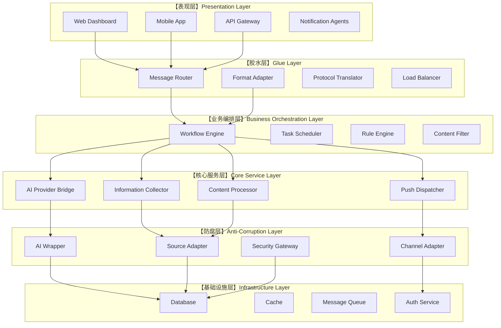
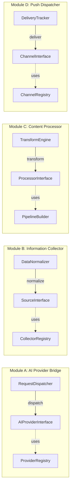
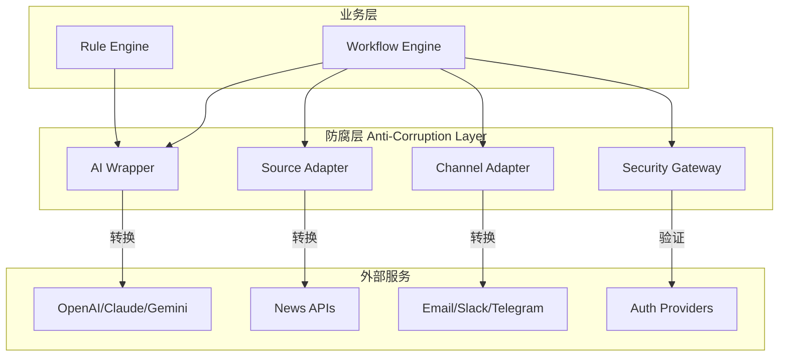
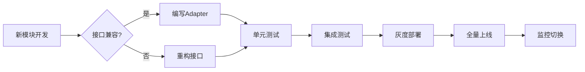
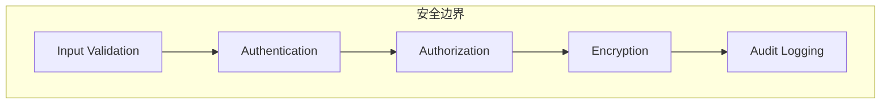
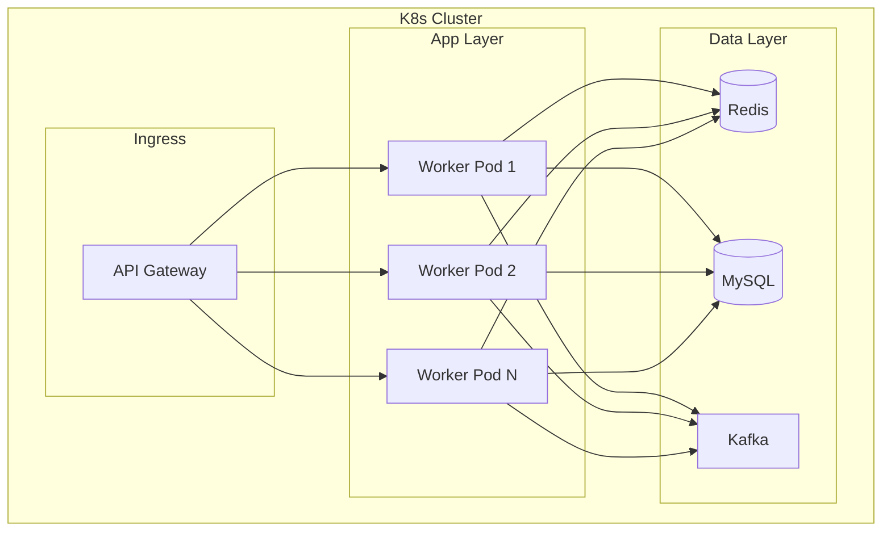

# AI高度客制化资讯推送系统可行性架构设计

## 一、架构设计总览

### 1.1 设计目标

本架构旨在构建一个**高度客制化、可扩展、安全可靠**的AI资讯推送系统，核心设计原则如下：

- **高模块化**：每个功能单元独立封装，职责单一
- **高拓展性**：通过插件机制和接口抽象支持功能扩展
- **胶水层架构**：通过适配器粘合不同模块，处理协议转换
- **弱耦合、可拔插**：模块间通过接口通信，支持热插拔
- **SOLID原则**：严格遵循面向对象设计原则
- **防腐层设计**：预置Wrapper与Dispatcher机制，确保模块可平滑替换

### 1.2 系统架构层次图



---

## 二、核心模块设计

### 2.1 模块架构总览



### 2.2 模块详细设计

#### 2.2.1 AI Provider Bridge（AI提供者桥接器）

**职责**：统一管理多种AI服务的接入，支持灵活切换

**接口定义**：

```typescript
// AI Provider Interface - 单一职责原则
interface IAIProvider {
    // 发送请求到AI服务
    sendRequest(prompt: Prompt): Promise<AIResponse>;
  
    // 获取提供商元信息
    getMetadata(): ProviderMetadata;
  
    // 健康检查
    healthCheck(): Promise<boolean>;
}

// Prompt抽象 - 开闭原则
interface Prompt {
    content: string;
    parameters: Record<string, any>;
    options?: RequestOptions;
}

// AI响应抽象
interface AIResponse {
    content: string;
    metadata: ResponseMetadata;
    usage: UsageInfo;
}
```

**模块结构**：

```
ai-provider-bridge/
├── interfaces/
│   ├── IAIProvider.ts
│   ├── IPrompt.ts
│   └── IResponse.ts
├── providers/
│   ├── base/
│   │   └── BaseProvider.ts
│   ├── openai/
│   │   └── OpenAIProvider.ts
│   ├── anthropic/
│   │   └── AnthropicProvider.ts
│   ├── google/
│   │   └── GoogleAIProvider.ts
│   └── custom/
│       └── CustomProvider.ts
├── registry/
│   └── ProviderRegistry.ts
├── dispatcher/
│   └── RequestDispatcher.ts
└── factory/
    └── ProviderFactory.ts
```

**防腐层设计 - AI Wrapper**：

```typescript
// AI Provider Wrapper - 防腐层核心
class AIProviderWrapper implements IAIProvider {
    private provider: IAIProvider;
    private retryStrategy: IRetryStrategy;
    private circuitBreaker: ICircuitBreaker;
    private logger: ILogger;

    constructor(
        provider: IAIProvider,
        config: WrapperConfig
    ) {
        this.provider = provider;
        this.retryStrategy = new ExponentialBackoffRetry();
        this.circuitBreaker = new CircuitBreaker(config.circuitBreakerThreshold);
    }

    async sendRequest(prompt: Prompt): Promise<AIResponse> {
        // 1. 熔断器检查
        if (this.circuitBreaker.isOpen()) {
            throw new CircuitBreakerOpenException();
        }

        // 2. 重试策略
        try {
            return await this.retryStrategy.execute(
                () => this.provider.sendRequest(prompt)
            );
        } catch (error) {
            this.circuitBreaker.recordFailure();
            throw error;
        }
    }
}
```

#### 2.2.2 Information Collector（信息采集器）

**职责**：从多种来源采集资讯，支持结构化/非结构化数据

**接口定义**：

```typescript
// 信息源接口 - 里氏替换原则
interface IInformationSource {
    // 采集数据
    collect(config: SourceConfig): Promise<RawData[]>;
  
    // 验证源可用性
    validate(): Promise<boolean>;
  
    // 获取源类型
    getType(): SourceType;
}

// 源配置抽象
interface SourceConfig {
    url: string;
    auth?: AuthConfig;
    pollingInterval?: number;
    retryPolicy?: IRetryPolicy;
}
```

**模块结构**：

```
information-collector/
├── interfaces/
│   ├── IInformationSource.ts
│   ├── ISourceConfig.ts
│   └── IDataNormalizer.ts
├── sources/
│   ├── base/
│   │   └── BaseSource.ts
│   ├── rss/
│   │   └── RSSSource.ts
│   ├── api/
│   │   └── APISource.ts
│   ├── web/
│   │   └── WebScraperSource.ts
│   ├── database/
│   │   └── DatabaseSource.ts
│   └── social/
│       └── SocialMediaSource.ts
├── normalizer/
│   └── DataNormalizer.ts
├── registry/
│   └── SourceRegistry.ts
└── adapter/
    └── SourceAdapter.ts  # 防腐层
```

#### 2.2.3 Content Processor（内容处理器）

**职责**：对采集的原始内容进行AI处理、分类、摘要

**接口定义**：

```typescript
// 处理器接口 - 接口隔离原则
interface IContentProcessor {
    process(content: RawContent): Promise<ProcessedContent>;
    getProcessorType(): ProcessorType;
}

// 专业化处理器 - 职责单一
interface ISummarizer extends IContentProcessor {
    summarize(content: RawContent, options: SummaryOptions): Promise<Summary>;
}

interface IClassifier extends IContentProcessor {
    classify(content: RawContent): Promise<Category[]>;
}

interface ITranslator extends IContentProcessor {
    translate(content: RawContent, targetLang: string): Promise<TranslatedContent>;
}
```

**处理管道设计**：

```typescript
// 处理管道构建器 - 依赖倒置原则
class ProcessingPipelineBuilder {
    private processors: IContentProcessor[] = [];

    addProcessor(processor: IContentProcessor): this {
        this.processors.push(processor);
        return this;
    }

    build(): ProcessingPipeline {
        return new ProcessingPipeline(this.processors);
    }
}

class ProcessingPipeline {
    constructor(private processors: IContentProcessor[]) {}

    async execute(input: RawContent): Promise<ProcessedContent> {
        let result = input;
        for (const processor of this.processors) {
            result = await processor.process(result);
        }
        return result;
    }
}
```

#### 2.2.4 Push Dispatcher（推送调度器）

**职责**：将处理后的内容分发到多种渠道

**接口定义**：

```typescript
// 推送渠道接口 - 开闭原则
interface IPushChannel {
    send(content: ProcessedContent, target: PushTarget): Promise<DeliveryResult>;
    getChannelType(): ChannelType;
    validateTarget(target: PushTarget): boolean;
}

// 推送目标
interface PushTarget {
    userId: string;
    channel: ChannelType;
    address: string;  // email, device token, etc.
    preferences?: UserPreferences;
}
```

**模块结构**：

```
push-dispatcher/
├── interfaces/
│   ├── IPushChannel.ts
│   ├── IPushTarget.ts
│   └── IDeliveryTracker.ts
├── channels/
│   ├── base/
│   │   └── BaseChannel.ts
│   ├── email/
│   │   └── EmailChannel.ts
│   ├── webhook/
│   │   └── WebhookChannel.ts
│   ├── telegram/
│   │   └── TelegramChannel.ts
│   ├── slack/
│   │   └── SlackChannel.ts
│   ├── mobile/
│   │   └── MobilePushChannel.ts
│   └── custom/
│       └── CustomChannel.ts
├── tracker/
│   └── DeliveryTracker.ts
└── adapter/
    └── ChannelAdapter.ts  # 防腐层
```

---

## 三、防腐层设计

### 3.1 防腐层架构图



### 3.2 Wrapper与Dispatcher设计

#### 3.2.1 AI Provider Wrapper

```typescript
// 统一的AI Provider包装器
class UnifiedAIWrapper {
    private wrappers: Map<string, AIProviderWrapper> = new Map();
    private fallbackStrategy: FallbackStrategy;

    registerProvider(name: string, wrapper: AIProviderWrapper): void {
        this.wrappers.set(name, wrapper);
    }

    async dispatch(request: AIRequest): Promise<AIResponse> {
        const providerName = this.selectProvider(request);
      
        try {
            return await this.wrappers.get(providerName).sendRequest(request.prompt);
        } catch (error) {
            // 故障转移策略
            return await this.fallbackStrategy.handle(error, request);
        }
    }

    private selectProvider(request: AIRequest): string {
        // 基于请求特性选择最优Provider
        return this.loadBalancer.select(request);
    }
}
```

#### 3.2.2 Source Adapter（源适配器）

```typescript
// 数据源适配器 - 隔离外部变化
class SourceAdapter implements IInformationSource {
    private adapter: ExternalSourceAdapter;
    private translator: DataTranslator;
    private validator: InputValidator;

    async collect(config: SourceConfig): Promise<RawData[]> {
        // 1. 配置验证
        this.validator.validate(config);

        // 2. 转换为外部系统格式
        const externalConfig = this.translator.toExternal(config);

        // 3. 调用外部系统
        const rawData = await this.adapter.fetch(externalConfig);

        // 4. 转换为内部格式
        return rawData.map(item => this.translator.toInternal(item));
    }
}
```

#### 3.2.3 Channel Adapter（渠道适配器）

```typescript
// 推送渠道适配器 - 隔离外部API变化
class ChannelAdapter implements IPushChannel {
    private externalAdapter: ExternalChannelAdapter;
    private formatConverter: MessageFormatter;
    private rateLimiter: RateLimiter;

    async send(content: ProcessedContent, target: PushTarget): Promise<DeliveryResult> {
        // 1. 速率限制检查
        await this.rateLimiter.check(target);

        // 2. 格式转换
        const formattedMessage = this.formatConverter.format(content, target.channel);

        // 3. 发送并跟踪
        const result = await this.externalAdapter.send(formattedMessage, target);

        return this.tracker.track(result);
    }
}
```

---

## 四、模块替换策略

### 4.1 模块替换流程图



### 4.2 模块替换准备清单

| 替换类型        | 准备内容                 | 防腐层组件        |
| --------------- | ------------------------ | ----------------- |
| AI Provider替换 | 新Provider实现、熔断配置 | AIProviderWrapper |
| 数据源替换      | 新源Adapter、字段映射    | SourceAdapter     |
| 推送渠道替换    | 新渠道Adapter、格式转换  | ChannelAdapter    |
| 存储层替换      | 新存储Adapter、查询转换  | StorageAdapter    |

### 4.3 版本兼容策略

```typescript
// 版本兼容性检查
class VersionCompatibilityChecker {
    checkCompatibility(
        oldModule: IModuleVersion,
        newModule: IModuleVersion
    ): CompatibilityResult {
        const breakingChanges = this.detectBreakingChanges(
            oldModule.interface,
            newModule.interface
        );

        return {
            isCompatible: breakingChanges.length === 0,
            breakingChanges,
            migrationPath: this.suggestMigration(breakingChanges)
        };
    }
}
```

---

## 五、安全架构设计

### 5.1 安全层次结构



### 5.2 安全网关设计

```typescript
// Security Gateway - 统一安全入口
class SecurityGateway {
    private validators: InputValidator[] = [];
    private authProvider: IAuthProvider;
    private encryptor: IEncryptor;
    private auditLogger: IAuditLogger;

    async validateRequest(request: Request): Promise<ValidationResult> {
        // 1. 输入验证
        for (const validator of this.validators) {
            const result = await validator.validate(request);
            if (!result.isValid) {
                this.auditLogger.log('VALIDATION_FAILED', request);
                return result;
            }
        }

        // 2. 身份认证
        const authResult = await this.authProvider.authenticate(request.token);
        if (!authResult.isAuthenticated) {
            this.auditLogger.log('AUTH_FAILED', request);
            throw new AuthenticationException();
        }

        // 3. 权限检查
        if (!this.checkAuthorization(authResult.user, request.resource)) {
            this.auditLogger.log('AUTHZ_FAILED', request);
            throw new AuthorizationException();
        }

        return { isValid: true };
    }
}
```

---

## 六、SOID原则实现对照表

| 原则                 | 实现方式               | 具体措施                             |
| -------------------- | ---------------------- | ------------------------------------ |
| **S 单一职责** | 每个类只负责一个功能   | Processor只做处理、Collector只做采集 |
| **O 开闭原则** | 对扩展开放，对修改关闭 | 通过继承和接口实现新功能             |
| **L 里氏替换** | 子类可替换父类         | 所有Provider继承BaseProvider         |
| **I 接口隔离** | 多个专用接口           | ISummarizer、IClassifier分离         |
| **D 依赖倒置** | 依赖抽象而非具体       | 依赖IAIProvider而非OpenAIProvider    |

---

## 七、模块依赖关系矩阵

| 模块                  | 依赖模块                       | 依赖类型 | 可替换性   |
| --------------------- | ------------------------------ | -------- | ---------- |
| AI Provider Bridge    | ILogger, IRetryStrategy        | 接口     | 完全可替换 |
| Information Collector | IDataNormalizer, ICache        | 接口     | 完全可替换 |
| Content Processor     | IAIProvider, IPipeline         | 接口     | 完全可替换 |
| Push Dispatcher       | IDeliveryTracker, IRateLimiter | 接口     | 完全可替换 |
| Workflow Engine       | 所有业务模块                   | 接口     | 核心模块   |
| Security Gateway      | IAuthProvider, IEncryptor      | 接口     | 完全可替换 |

---

## 八、部署架构建议



---

## 九、总结

本架构设计通过以下关键设计实现您的需求：

1. **胶水层设计**：通过Adapter和Wrapper处理模块间协议转换
2. **防腐层**：预置SourceAdapter、ChannelAdapter、AIProviderWrapper
3. **可拔插模块**：基于接口的模块注册机制，支持热插拔
4. **SOLID合规**：严格的接口隔离和依赖倒置
5. **安全优先**：多层安全防护，统一安全网关
6. **扩展性**：通过Provider Registry和Channel Registry支持无限扩展

此架构可支持未来：

- 新增AI Provider（如新的大模型）
- 新增资讯来源（新的RSS源、API）
- 新增推送渠道（新的社交平台）
- 存储层迁移（从MySQL到PostgreSQL）

无需修改核心业务逻辑，仅需添加对应的Adapter即可。
